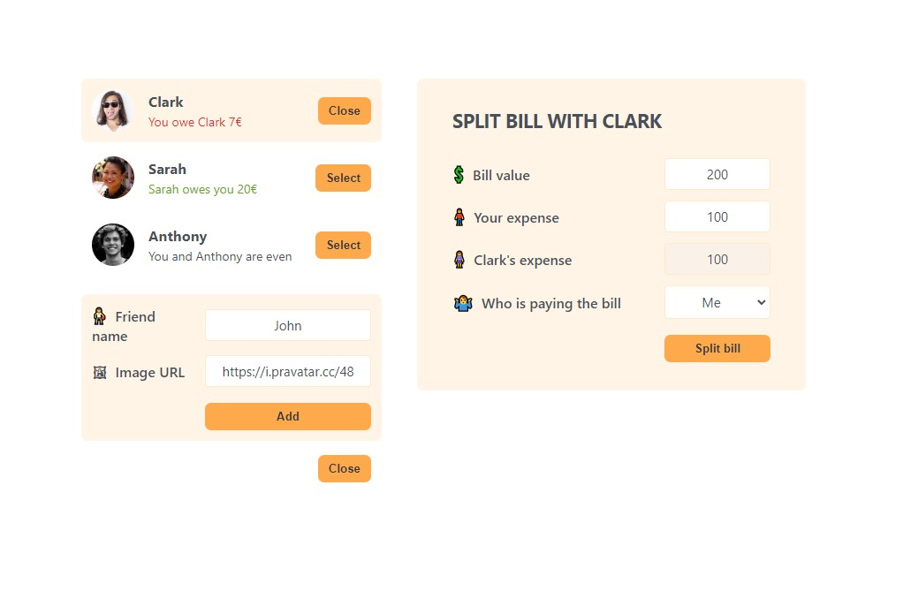

# Eat n' Split

## Table of contents

- [Overview](#overview)
  - [The challenge](#the-challenge)
  - [Screenshot](#screenshot)
  - [Links](#links)
- [My process](#my-process)
  - [Built with](#built-with)
  - [What I learned](#what-i-learned)
  - [Continued development](#continued-development)
- [Author](#author)

## Overview

### The challenge

Users should be able to:

- View the optimal layout for the app depending on their device's screen size
- See a list of friends with amounts of money owed to you or them
- Can add a friend with a new chosen name and random profile name generated
- Select a friend, split bill window shows
- Input bill amount, your expense of the bill and friends expense is calculated
- Use the split button to update the amounts owed to one another

### Screenshot

### Links

- Live Site URL: [View](https://eatnsplit2.netlify.app/)

## My process

- This React application manages a list of friends and allows users to add new friends, view their balances, and split bills with selected friends.
- The `App` component manages the state for showing the add friend form, the list of friends, and the selected friend for bill splitting.
- When a friend is selected, it displays a form to split the bill, where users can input the bill amount, their own expense, and select who is paying.
- Upon submission, the bill is split accordingly, and the balances are updated.
- The application components are structured to efficiently handle state updates and provide a user-friendly interface for managing friendships and expenses.

### Built with

- Semantic HTML5 markup
- CSS custom properties
- Mobile-Responsive Design
- JavaScript - Scripting language
- [React](https://reactjs.org/) - JS library

### What I learned

This is a class exercise implementing things taught so far on react

### Continued development

Maybe used for reference.

## Author

- Website - [Cameron Howze](https://camkol.github.io/)
- Frontend Mentor - [@camkol](https://www.frontendmentor.io/profile/camkol)
- GitHub- [@camkol](https://github.com/camkol)
- LinkedIn - [@cameron-howze](https://www.linkedin.com/in/cameron-howze-28a646109/)
- E-Mail - [cameronhowze4@outlook.com](mailto:cameronhowze4@outlook.com)
